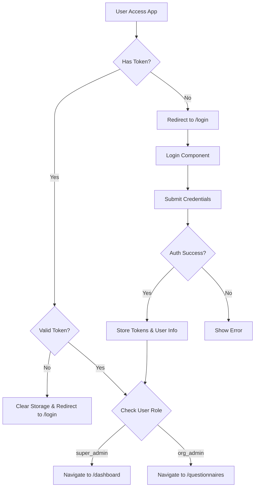
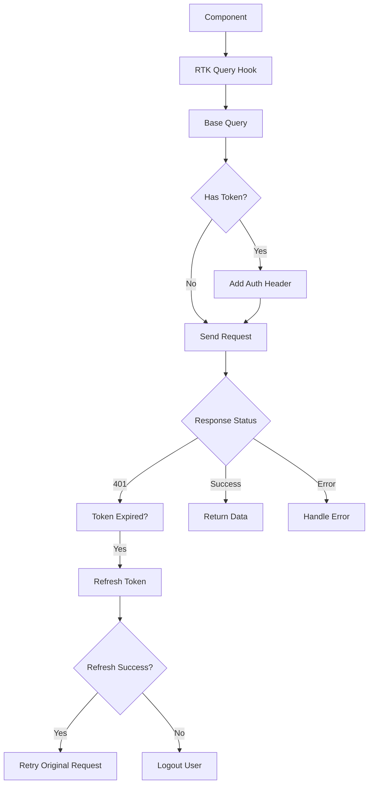
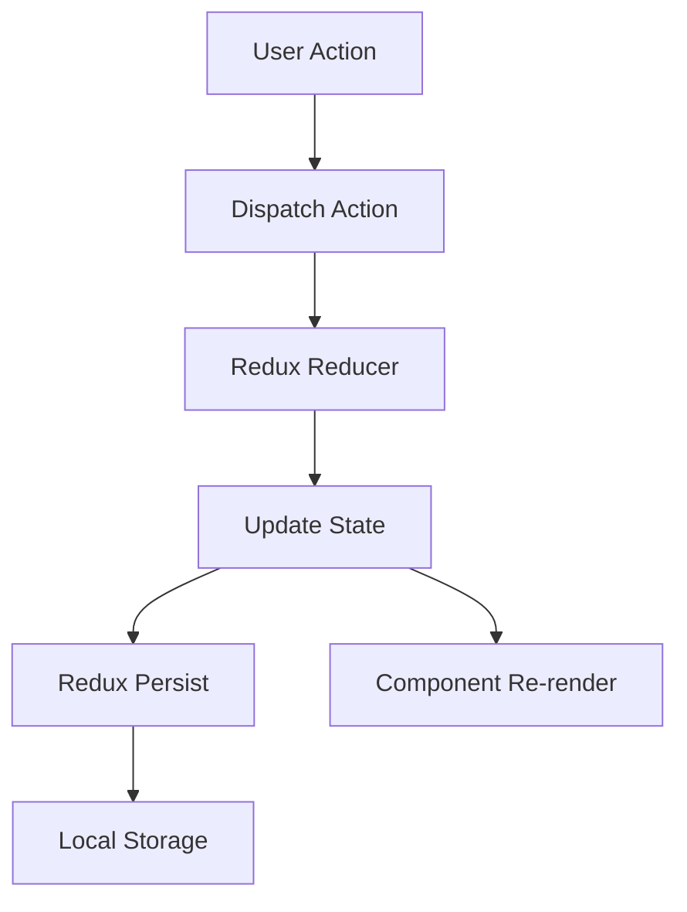

# LFB Frontend Refactoring Guide

## 📚 Table of Contents

1. [Current Application Architecture](#current-application-architecture)
2. [Application Flow Documentation](#application-flow-documentation)
3. [Step-by-Step Refactoring Plan](#step-by-step-refactoring-plan)
4. [Implementation Phases](#implementation-phases)

---

## 🏗️ Current Application Architecture

### Technology Stack

- **Framework**: Next.js 15.4.3 (App Router)
- **UI Library**: React 19.1.0
- **Language**: TypeScript 5.x
- **State Management**: Redux Toolkit + Redux Persist
- **API Layer**: RTK Query
- **Styling**: Tailwind CSS v4
- **Form Handling**: React Hook Form + Yup
- **UI Components**: Radix UI + Custom Components

### Current Folder Structure

```
frontend-web/
├── src/
│   ├── app/                    # Next.js App Router
│   │   ├── (auth)/             # Auth group routes
│   │   │   ├── login/
│   │   │   ├── verify/
│   │   │   └── welcome/
│   │   ├── (dashboard)/        # Dashboard group routes
│   │   │   ├── (admin)/        # Admin specific routes
│   │   │   └── dashboard/
│   │   ├── api/                # API routes
│   │   └── layout.tsx          # Root layout
│   ├── components/
│   │   ├── auth/               # Authentication components
│   │   ├── dashboard/          # Dashboard components
│   │   ├── org/                # Organization components
│   │   ├── questionnaires/     # Quiz components
│   │   ├── shared-component/   # Shared components
│   │   └── ui/                 # UI primitives
│   ├── services/
│   │   └── api-service/        # RTK Query services
│   ├── store/
│   │   └── slice/              # Redux slices
│   ├── hooks/                  # Custom hooks
│   ├── lib/                    # Utilities
│   └── common/                 # Constants and helpers
├── public/                     # Static assets
└── Configuration files
```

---

## 📋 Application Flow Documentation

### 1. Authentication Flow



#### Key Files in Auth Flow:

1. **Entry Point**: `src/app/page.tsx`
   - Checks authentication status
   - Routes based on user role

2. **Middleware**: `middleware.ts`
   - Server-side route protection
   - Cookie-based token validation

3. **Auth Guard**: `src/components/AuthGuard.tsx`
   - Client-side route protection
   - JWT token validation
   - Role-based access control

4. **Login Component**: `src/components/auth/Login.tsx`
   - Form handling
   - API call to login endpoint
   - Token & user info storage

5. **Redux Store**: `src/store/slice/userDetails.ts`
   - User state management
   - Token persistence

### 2. API Request Flow



#### Key Files in API Flow:

1. **API Base**: `src/services/index.ts`
   - Base query configuration
   - Token refresh logic
   - Error handling

2. **Service Files**: `src/services/api-service/*.ts`
   - Individual API endpoints
   - RTK Query definitions

### 3. State Management Flow



### 4. Role-Based Access Control

- **Super Admin**: Access to /dashboard and organization management
- **Org Admin**: Access to /questionnaires, /solved-quiz, /users
- **Unauthorized**: Redirected to /unauthorized page

---

## 📝 Step-by-Step Refactoring Plan

### ⚠️ IMPORTANT: Non-Breaking Approach

Each phase is designed to:

- ✅ Maintain existing functionality
- ✅ Be reversible if issues arise
- ✅ Be tested independently
- ✅ Not affect other parts of the system

---

## 🚀 Implementation Phases

### Phase 1: Security & Critical Fixes (No Breaking Changes)

**Timeline**: 1-2 days **Risk Level**: Low **Testing Required**: Minimal

#### Step 1.1: Remove Console Logs

```typescript
// BEFORE (middleware.ts)
export function middleware(req: NextRequest) {
  console.info("=== MIDDLEWARE EXECUTING ===");
  console.info("Path:", req.nextUrl.pathname);
  //...
}

// AFTER
export function middleware(req: NextRequest) {
  // Remove all console.info/log in production
  if (process.env.NODE_ENV === "development") {
    console.info("=== MIDDLEWARE EXECUTING ===");
    console.info("Path:", req.nextUrl.pathname);
  }
  //...
}
```

#### Step 1.2: Create Environment Variables File

```bash
# .env.local
NEXT_PUBLIC_API_BASE_URL=https://your-api-url.com/api
NEXT_PUBLIC_APP_ENV=development
NEXT_PUBLIC_ENABLE_LOGGING=true
```

#### Step 1.3: Create Secure Logger Utility

```typescript
// src/lib/logger.ts
const isDev = process.env.NODE_ENV === "development";
const enableLogging = process.env.NEXT_PUBLIC_ENABLE_LOGGING === "true";

export const logger = {
  info: (...args: any[]) => {
    if (isDev && enableLogging) console.info(...args);
  },
  error: (...args: any[]) => {
    if (isDev && enableLogging) console.error(...args);
  },
  warn: (...args: any[]) => {
    if (isDev && enableLogging) console.warn(...args);
  },
};
```

#### Step 1.4: Fix Hardcoded API URLs

```typescript
// src/services/index.ts
// BEFORE
baseUrl: process.env.NEXT_PUBLIC_API_BASE_URL || "https://tkt8nkkb-3002.inc1.devtunnels.ms/api",

// AFTER
baseUrl: process.env.NEXT_PUBLIC_API_BASE_URL,
```

### Phase 2: Code Quality Improvements (No Breaking Changes)

**Timeline**: 2-3 days **Risk Level**: Low **Testing Required**: Component testing

#### Step 2.1: Add TypeScript Types

```typescript
// src/types/auth.types.ts
export interface User {
  email: string;
  name: string;
  role: "super_admin" | "org_admin";
  userId?: string;
}

export interface Organization {
  organizationId: string;
  name: string;
  domain: string;
  logoUrl: string;
  description: string;
}

export interface AuthTokens {
  accessToken: string;
  refreshToken: string;
}

export interface AuthState {
  userInfo: User | null;
  orgInfo: Organization | null;
  token: AuthTokens;
}
```

#### Step 2.2: Create Custom Hooks for Common Logic

```typescript
// src/hooks/useAuth.ts
import { useAppSelector, useAppDispatch } from "./reduxHook";
import { useRouter } from "next/navigation";

export const useAuth = () => {
  const dispatch = useAppDispatch();
  const router = useRouter();
  const { userInfo, token, orgInfo } = useAppSelector((state) => state.userDetails);

  const isAuthenticated = !!token.accessToken;
  const isSuperAdmin = userInfo?.role === "super_admin";
  const isOrgAdmin = userInfo?.role === "org_admin";

  const navigateBasedOnRole = () => {
    if (isSuperAdmin) {
      router.push("/dashboard");
    } else if (isOrgAdmin) {
      router.push("/questionnaires");
    } else {
      router.push("/login");
    }
  };

  return {
    userInfo,
    token,
    orgInfo,
    isAuthenticated,
    isSuperAdmin,
    isOrgAdmin,
    navigateBasedOnRole,
  };
};
```

#### Step 2.3: Create Error Boundary Component

```typescript
// src/components/shared-component/ErrorBoundary.tsx
import React from 'react';

interface Props {
  children: React.ReactNode;
  fallback?: React.ComponentType<{ error: Error }>;
}

interface State {
  hasError: boolean;
  error: Error | null;
}

export class ErrorBoundary extends React.Component<Props, State> {
  constructor(props: Props) {
    super(props);
    this.state = { hasError: false, error: null };
  }

  static getDerivedStateFromError(error: Error): State {
    return { hasError: true, error };
  }

  componentDidCatch(error: Error, info: React.ErrorInfo) {
    console.error('Error boundary caught:', error, info);
  }

  render() {
    if (this.state.hasError) {
      const Fallback = this.props.fallback;
      if (Fallback) {
        return <Fallback error={this.state.error!} />;
      }
      return (
        <div className="p-4 text-center">
          <h2>Something went wrong</h2>
          <p>{this.state.error?.message}</p>
        </div>
      );
    }

    return this.props.children;
  }
}
```

### Phase 3: Performance Optimizations (No Breaking Changes)

**Timeline**: 2-3 days **Risk Level**: Low **Testing Required**: Performance testing

#### Step 3.1: Add React.memo to Heavy Components

```typescript
// src/components/org/OrgCards.tsx
import React from "react";

// BEFORE
export default function OrgCards({ data }: Props) {
  // component logic
}

// AFTER
const OrgCards = React.memo(({ data }: Props) => {
  // component logic
});

export default OrgCards;
```

#### Step 3.2: Implement Code Splitting

```typescript
// src/app/(dashboard)/layout.tsx
import dynamic from 'next/dynamic';

// Lazy load heavy components
const Navbar = dynamic(() => import('@/components/dashboard/Navbar'), {
  loading: () => <div>Loading...</div>,
});

const Footer = dynamic(() => import('@/components/dashboard/Footer'), {
  loading: () => <div>Loading...</div>,
});
```

#### Step 3.3: Add Image Optimization

```typescript
// Use Next.js Image component everywhere
import Image from 'next/image';

// BEFORE


// AFTER
<Image
  src="/logo.png"
  alt="Logo"
  width={100}
  height={100}
  priority={false}
  loading="lazy"
/>
```

### Phase 4: Testing Setup (New Addition)

**Timeline**: 1-2 days **Risk Level**: None **Testing Required**: N/A

#### Step 4.1: Add Testing Libraries

```json
// package.json
{
  "devDependencies": {
    "@testing-library/react": "^14.0.0",
    "@testing-library/jest-dom": "^6.0.0",
    "jest": "^29.0.0",
    "jest-environment-jsdom": "^29.0.0"
  }
}
```

#### Step 4.2: Create Test for Critical Components

```typescript
// src/components/auth/__tests__/Login.test.tsx
import { render, screen, fireEvent } from '@testing-library/react';
import Login from '../Login';

describe('Login Component', () => {
  it('renders login form', () => {
    render(<Login />);
    expect(screen.getByPlaceholderText('Enter email address')).toBeInTheDocument();
    expect(screen.getByPlaceholderText('Enter password')).toBeInTheDocument();
  });

  it('validates email format', async () => {
    // test implementation
  });
});
```

### Phase 5: Folder Structure Migration (Major Change - Last)

**Timeline**: 3-4 days **Risk Level**: Medium **Testing Required**: Full regression testing

This phase should be done last, after all other improvements are stable.

#### Step 5.1: Create New Structure (Parallel to Existing)

```bash
src/
├── features/              # NEW - Feature modules
│   ├── auth/
│   │   ├── components/
│   │   ├── hooks/
│   │   ├── services/
│   │   └── types/
│   └── dashboard/
├── shared/                # NEW - Shared resources
└── infrastructure/        # NEW - Core setup
```

#### Step 5.2: Gradually Move Files

1. Start with one feature (e.g., auth)
2. Update imports
3. Test thoroughly
4. Move next feature

---

## 📊 Testing Strategy for Each Phase

### Phase 1 Testing Checklist

- [ ] Login flow works
- [ ] Token refresh works
- [ ] Protected routes work
- [ ] No console logs in production build

### Phase 2 Testing Checklist

- [ ] All TypeScript errors resolved
- [ ] Custom hooks work correctly
- [ ] Error boundaries catch errors
- [ ] No regression in functionality

### Phase 3 Testing Checklist

- [ ] Page load time improved
- [ ] No visual regressions
- [ ] Lazy loading works
- [ ] Images load correctly

### Phase 4 Testing Checklist

- [ ] All tests pass
- [ ] Coverage report generated
- [ ] Critical paths covered

### Phase 5 Testing Checklist

- [ ] Full regression testing
- [ ] All imports resolved
- [ ] Build succeeds
- [ ] No broken functionality

---

## 🎯 Success Metrics

1. **Security**: No exposed sensitive data in console
2. **Performance**: 20% improvement in initial load time
3. **Code Quality**: 0 TypeScript errors
4. **Maintainability**: Clear separation of concerns
5. **Testing**: 70% code coverage for critical paths

---

## 📅 Implementation Timeline

| Phase   | Duration | Start Date | End Date | Status  |
| ------- | -------- | ---------- | -------- | ------- |
| Phase 1 | 1-2 days | TBD        | TBD      | Pending |
| Phase 2 | 2-3 days | TBD        | TBD      | Pending |
| Phase 3 | 2-3 days | TBD        | TBD      | Pending |
| Phase 4 | 1-2 days | TBD        | TBD      | Pending |
| Phase 5 | 3-4 days | TBD        | TBD      | Pending |

**Total Duration**: 9-14 days

---

## 🚦 Rollback Strategy

Each phase can be rolled back independently:

1. **Git Strategy**: Create a branch for each phase
2. **Testing**: Comprehensive testing before merging
3. **Deployment**: Deploy to staging first
4. **Monitoring**: Monitor for 24 hours before next phase

---

## 📝 Notes

- Always backup current working code before starting a phase
- Test each change incrementally
- Document any deviations from the plan
- Communicate with team before major changes
